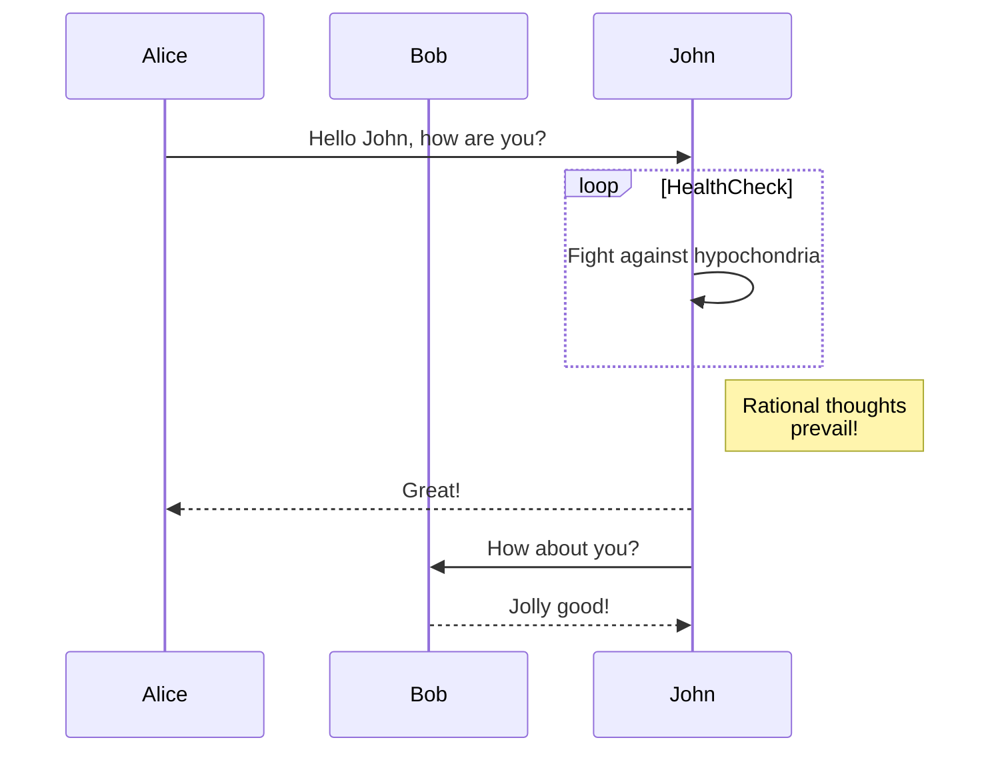

# go-musthave-diploma-tpl

Шаблон репозитория для индивидуального дипломного проекта курса «Go-разработчик»

# Начало работы

1. Склонируйте репозиторий в любую подходящую директорию на вашем компьютере.
2. В корне репозитория выполните команду `go mod init <name>` (где `<name>` — адрес вашего репозитория на GitHub без
   префикса `https://`) для создания модуля

# Обновление шаблона

Чтобы иметь возможность получать обновления автотестов и других частей шаблона, выполните команду:

```
git remote add -m master template https://github.com/yandex-praktikum/go-musthave-diploma-tpl.git
```

Для обновления кода автотестов выполните команду:

```
git fetch template && git checkout template/master .github
```

Затем добавьте полученные изменения в свой репозиторий.

# Диаграммы решения



### Алгоритмы обработчиков

#### **Регистрация пользователя**

* `POST /api/user/register` 

- Без мидлваря аутентификации
- Каждый логин должен быть уникальным.
- После успешной регистрации должна происходить автоматическая аутентификация пользователя.

Формат запроса:

```
POST /api/user/register HTTP/1.1
Content-Type: application/json
...

{
	"login": "<login>",
	"password": "<password>"
}
```

Возможные коды ответа:

- `200` — пользователь успешно зарегистрирован и аутентифицирован;
- `400` — неверный формат запроса;
- `409` — логин уже занят;
- `500` — внутренняя ошибка сервера.

1. Проверка Content-Type
2. Получение тела запроса
3. Сокрытие пароля
4. Генерация uuid
4. Отправка запроса в БД для добавления записи (логин и пароль) в таблицу users (баланс по дефолту = 0).
    Если возникла ошибка (логин не уникальный), то возвращаем 409
5. Формируем JWT и кладём её в куки
6. Возвращаем 200

#### **Аутентификация пользователя**

Хендлер: `POST /api/user/login`.

- Без мидлваря аутентификации
- Аутентификация производится по паре логин/пароль.

Формат запроса:

```
POST /api/user/login HTTP/1.1
Content-Type: application/json
...

{
	"login": "<login>",
	"password": "<password>"
}
```

Возможные коды ответа:

- `200` — пользователь успешно аутентифицирован;
- `400` — неверный формат запроса;
- `401` — неверная пара логин/пароль;
- `500` — внутренняя ошибка сервера.

1. Проверка Content-Type
2. Получение тела запроса
3. Сокрытие пароля
4. Отправка запроса в БД дял проверки совпадения пароля для указанного логина (select id from users where login like login and password like password)
    Если не совпадает, то возвращаем 401
5. Формируем JWT и клалём в куки
6. Возвращаем 200