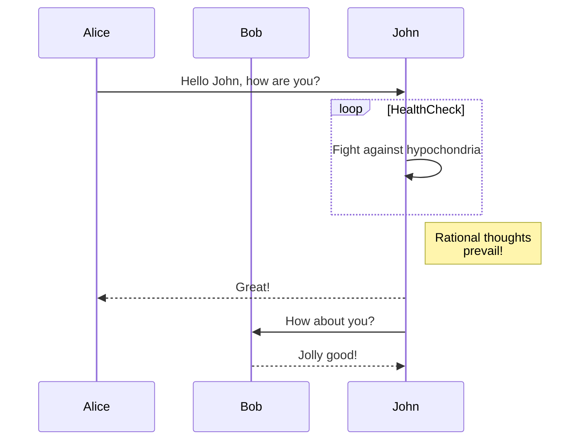

# Gophermart service

### Диаграмма Базы данных

#### Архитектура БД (вариант 1, актуальная)


```
CREATE TABLE users
(
    id uuid PRIMARY KEY,
    login varchar NOT NULL UNIQUE,
    password varchar NOT NULL
);

CREATE TYPE status AS ENUM ('NEW', 'PROCESSING', 'INVALID', 'PROCESSED');

CREATE TABLE orders
(
    id serial PRIMARY KEY,
    number varchar NOT NULL UNIQUE,
    user_id uuid NOT NULL REFERENCES users(id) ON DELETE CASCADE,
    uploaded_at timestamptz DEFAULT NOW(),
    status_processing status NOT NULL,
    accrual integer DEFAULT 0
); 


CREATE TABLE withdraws
(
    id serial PRIMARY KEY,
    withdraw_number varchar NOT NULL,
    sum integer NOT NULL,
    user_id uuid NOT NULL REFERENCES users(id) ON DELETE CASCADE,
    processed_at timestamptz DEFAULT NOW()
);
```

#### Архитектура БД (вариант 2, в проекте пока не применяется)


```
CREATE TABLE users
(
    id uuid PRIMARY KEY,
    login varchar NOT NULL UNIQUE,
    password varchar NOT NULL
);

CREATE TYPE status AS ENUM ('NEW', 'PROCESSING', 'INVALID', 'PROCESSED');
CREATE TYPE transaction_type AS ENUM ('PLUS', 'MINUS');

-- информация обо всех начислениях и списаниях
CREATE TABLE transactions
(
	id serial PRIMARY KEY,
	amount integer NOT NULL, -- количество баллов
	type transaction_type NOT NULL, -- тип транзакции: начисление или списание
	timestamp timestamptz DEFAULT NOW(),
	user_id	uuid NOT NULL REFERENCES users(id) ON DELETE CASCADE
);

-- информация о заказах, которые добавляет пользователь в систему
CREATE TABLE orders
(
    id serial PRIMARY KEY,
    number varchar NOT NULL UNIQUE, -- номер заказа
    user_id uuid NOT NULL REFERENCES users(id) ON DELETE CASCADE,
    uploaded_at timestamptz DEFAULT NOW(),
    status_processing status NOT NULL, -- статус заказа
    transaction_id integer REFERENCES transactions(id) -- id транзакции(если произошло начисление баллов); может быть NULL, когда неизвестны баллы за заказ
); 

-- информация о заказах, в счёт которых пользователь списывает баллы с баланса
CREATE TABLE withdraws
(
    id serial PRIMARY KEY,
    number varchar NOT NULL, -- номер заказа
    user_id uuid NOT NULL REFERENCES users(id) ON DELETE CASCADE,
    uploaded_at timestamptz DEFAULT NOW(),
	transaction_id integer NOT NULL REFERENCES transactions(id) -- id транзакции списания баллов с баланса
);
```

### Алгоритмы обработчиков

#### **Регистрация пользователя**

* `POST /api/user/register` 

- Без мидлваря аутентификации
- Каждый логин должен быть уникальным.
- После успешной регистрации должна происходить автоматическая аутентификация пользователя.

Формат запроса:

```
POST /api/user/register HTTP/1.1
Content-Type: application/json
...

{
	"login": "<login>",
	"password": "<password>"
}
```

Возможные коды ответа:

- `200` — пользователь успешно зарегистрирован и аутентифицирован;
- `400` — неверный формат запроса;
- `409` — логин уже занят;
- `500` — внутренняя ошибка сервера.

1. Проверка Content-Type
2. Получение тела запроса
3. Сокрытие пароля(хэш с солью)
4. Генерация uuid
4. Отправка запроса в БД для добавления записи (логин и пароль) в таблицу users.
    Если возникла ошибка (логин не уникальный), то возвращаем 409
5. Формируем JWT и кладём её в куки
6. Возвращаем 200

#### **Аутентификация пользователя**

Хендлер: `POST /api/user/login`.

- Без мидлваря аутентификации
- Аутентификация производится по паре логин/пароль.

Формат запроса:

```
POST /api/user/login HTTP/1.1
Content-Type: application/json
...

{
	"login": "<login>",
	"password": "<password>"
}
```

Возможные коды ответа:

- `200` — пользователь успешно аутентифицирован;
- `400` — неверный формат запроса;
- `401` — неверная пара логин/пароль;
- `500` — внутренняя ошибка сервера.

1. Проверка Content-Type
2. Получение тела запроса
3. Сокрытие пароля
4. Отправка запроса в БД дял проверки совпадения пароля для указанного логина (select id from users where login like login and password like password)
    Если не совпадает, то возвращаем 401
5. Формируем JWT и клалём в куки
6. Возвращаем 200

# Диаграммы решения


